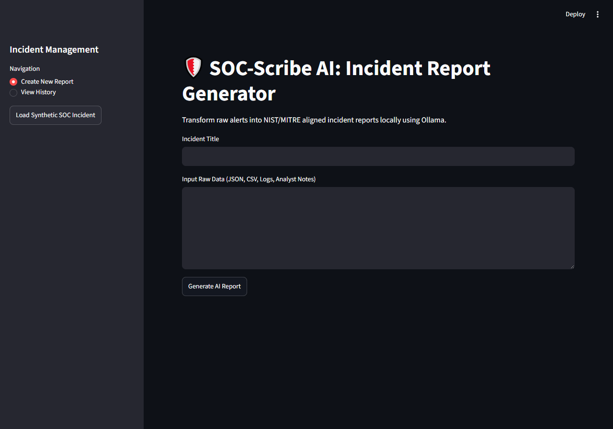
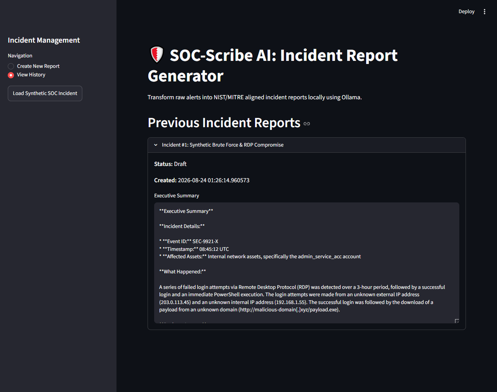

# SOC-Scribe AI 🛡️

**SOC-Scribe AI** is a free, local AI-powered incident reporting platform designed for SOC analysts. It transforms raw security alerts, investigation notes, logs, and timelines into structured, framework-aligned (NIST / MITRE ATT&CK) incident reports without relying on paid APIs or sending sensitive telemetry to the cloud.

---

## 📸 Screenshots

### 1. Main Dashboard & Report Generation

Transform raw alert inputs, IOCs, and analyst observations into structured Executive Summaries, Technical Analyses, and Response actions in real time:



### 2. Incident History & Database Tracking

Review, search, and manage previously analyzed incidents stored securely in the local SQLite database:



---

## 🚀 Key Features

* **100% Local AI:** Powered entirely by Ollama (Llama 3 / Mistral) to keep sensitive enterprise data private.
* **Framework Alignment:** Automatically maps analysis and attack behaviors to the **MITRE ATT&CK** matrix and **NIST Incident Response** guidance.
* **Multi-Format Ingestion:** Accepts JSON alerts, CSVs, SIEM exports, analyst notes, and raw log snippets.
* **Comprehensive Reporting:** Automatically sections output into:
* **Executive Summary:** High-level narrative, affected assets, business impact, and current status.
* **Technical Analysis:** Initial detection, timeline, IOC breakdown, root cause, and MITRE mapping.
* **Response & Remediation:** Containment, eradication, recovery, and lessons learned.


* **Flexible Export:** Download finalized reports in **DOCX**, **Markdown**, and **JSON** formats.
* **Built-in Synthetic Data:** Instantly test features using realistic simulated SOC scenarios.

---

## ⚖️ Strict AI Rules Enforced

The local LLM engine follows deterministic system instructions to ensure operational integrity:

1. Clearly distinguishes between **confirmed facts**, **analyst observations**, and **AI-generated hypotheses**.
2. **Never** hallucinates or fabricates evidence, IPs, domains, or log entries.
3. Preserves original source event IDs and log timestamps.

---

## 🛠️ Installation & Setup (Windows 10 / VS Code)

### 1. Start Ollama

Download and install [Ollama](https://ollama.com/), then pull and start your desired model:

```powershell
ollama run llama3

```

### 2. Clone Repository

```powershell
git clone https://github.com/JuttSahib1999/SOC-Scribe-AI.git
cd SOC-Scribe-AI

```

### 3. Setup Virtual Environment

```powershell
# Create a new virtual environment explicitly with Python 3.13
py -3.13 -m venv venv
# (Or use 'py -3.13 -m venv venv' depending on your preference)

# Activate the virtual environment
.\venv\Scripts\activate

# Install dependencies
pip install -r requirements.txt

```

### 4. Run Application

```powershell
streamlit run app.py

```

---

## 📂 Project Structure

```text
SOC-Scribe-AI/
├── app.py                     # Streamlit frontend & application orchestration
├── core/
│   ├── database.py            # SQLite ORM models and database initialization
│   ├── export_utils.py        # DOCX, Markdown, and JSON report exporters
│   ├── llm_engine.py          # Local LangChain + Ollama prompting engine
│   └── synthetic_data.py      # Built-in synthetic security incident generator
├── reports/
│   ├── test_1/
│   │   ├── report.docx        # Generated Word document for Test 1
│   │   ├── report.json        # Structured JSON export for Test 1
│   │   └── report.md          # Markdown export for Test 1
│   └── test_2/
│       ├── report.docx        # Generated Word document for Test 2
│       ├── report.json        # Structured JSON export for Test 2
│       └── report.md          # Markdown export for Test 2
├── screenshots/
│   ├── main_interface.png     # Screenshot of the main generator view
│   └── incident_history.png   # Screenshot of the stored history view
├── .gitignore
├── LICENSE
├── README.md
├── RELEASE.md
└── requirements.txt

```

---

## 👨‍💻 Author

Created by **Abdul Muqeet Tabraiz**

* **LinkedIn:** [Abdul Muqeet Tabraiz](https://www.linkedin.com/in/abdul-muqeet-tabraiz/)
* **GitHub:** [JuttSahib1999](https://github.com/JuttSahib1999)

---

## 📄 License

This project is licensed under the MIT License — see the LICENSE file for details.